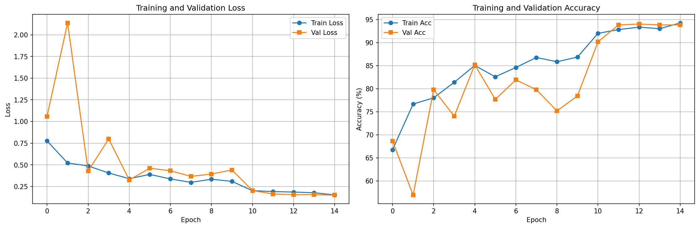

# Biomedical Image Corruption Detection System

A deep learning system for detecting and classifying image corruption in medial imaging datasets.

## Overview

This project addresses a challenging in medical imaging: detecting corrupted or degraded images before they lead to misdiagnosis. Using computer vision and deep learning, this system automatically identifies five types of image corruptions with 93.8% accuracy. 

## Features
- Multi-class corruption detection
- Real-time inference capability
- Trained on chest X-ray images
- Potential for production-ready PyTorch implementation
- Comprehensive evaluation metrics

## Performance Metrics

| Metric | Score |
|--------|-------|
| Overall Accuracy | 93.8% |
| Precision (weighted) | 94.3% |
| Recall (weighted) | 93.8% |
| F1-Score (weighted) | 93.8% |

### Pre-Class Performance

| Corruption Type | Precision | Recall | F1-Score | Number of Samples
|--------|-------|--------|-------|--------|
| Clean | 100% | 100% | 100% | 40 |
| Gaussian Noise | 82.1% | 95.8% | 88.5% | 120 |
| Motion Blur | 98.4% | 100% | 99.2% | 120 |
| Compression | 100% | 100% | 100% | 120 |
| Mixed | 94.9% | 77.5% | 85.3% | 120 |

## Model Architecture
- Base: ResNet-18 (pretrained on ImageNet)
- Modification: Custom classification head for 5 classes
- Input 224x224 RGB images (converted from grayscale)
- Output: Softmax probability distribution over corruption types

## Training Configuration 

```
Optimizer: Adam (lr=1e-3, weight_decay=1e-4)
Loss Function: CrossEntropyLoss
Scheduler: StepLR (step_size=10, gamma=0.1)
Epochs: 15
Batch Size: 32
```

## Data

Data can be downloaded from NIH Chest X-Ray dataset (https://www.kaggle.com/datasets/nih-chest-xrays/data). The usable subset of data and images used in this project were extracted from Data_Entry_2017.csv (compact) and images_001. Reproducibility with other image sets is currently being tested.

# Getting Started

## Prerequisites and Requirements

Look for the following prerequisites. Make sure to install needed requirements using the requirements.txt file within a created environment. 

```
Python 3.11+
PyTorch 2.0+
CUDA (optional, for GPU acceleration)
```
## Example Usage

All commands need to be executed from the main folder. Otherwise, the full path needs to be included in the command. 

```
# Clone repository
git clone <https://github.com/Ese973/Biomedical-Corruption-Detection>
cd Biomedical-Corruption-Detection


# Install dependencies
pip install torch torchvision opencv-python pandas matplotlib seaborn scikit-learn pillow tqdm
```

### Inference on New Images

```
from src.inference import CorruptionDetector

# Load model
detector = CorruptionDetector('models_saved/best_model.pth')

# Predict single image
result = detector.predict_image('path/to/image.png')
print(f"Prediction: {result['predicted_class']}")
print(f"Confidence: {result['confidence']:.1f}%")

# Visualize prediction
detector.visualize_prediction('path/to/image.png', save_path='results/prediction.png')
```

### Batch Processing

```
# Process multiple images
results = detector.batch_predict('path/to/image_folder/', max_images=50)

# Create demo visualization grid
detector.create_demo_grid('data/corrupted/corrupted_dataset.csv', save_path='results/demo_grid.png')
```

## Results Visualizations 

Training Curves

<div style="text-align:center"></div>